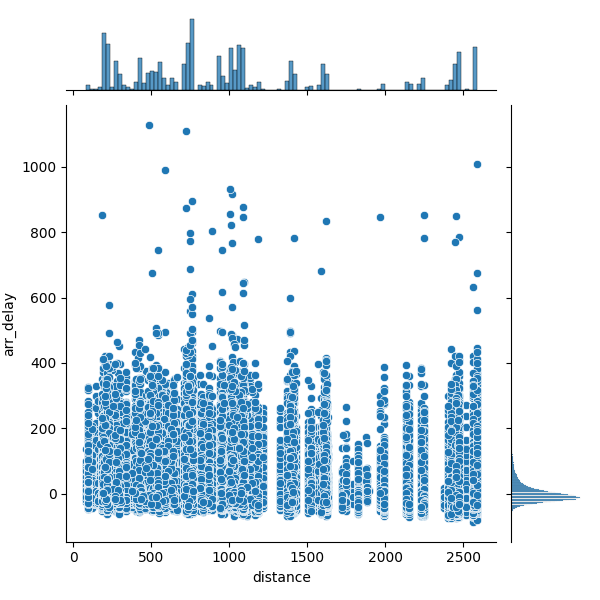
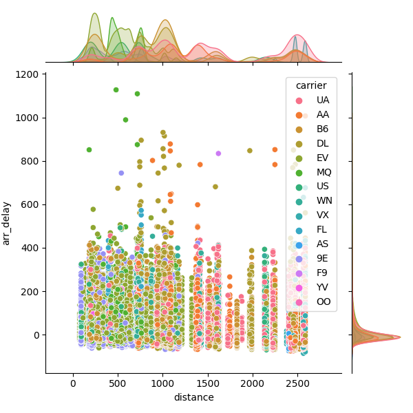
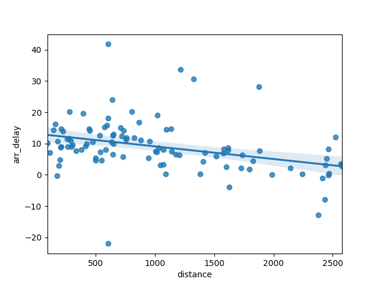
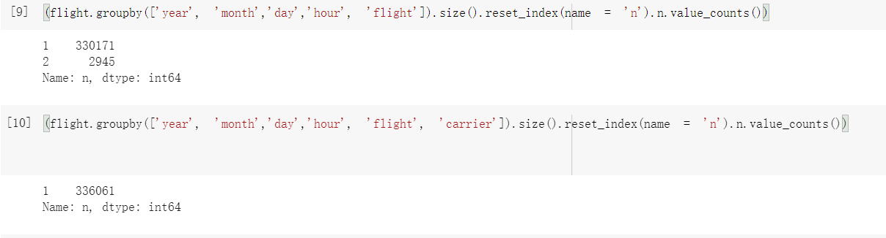
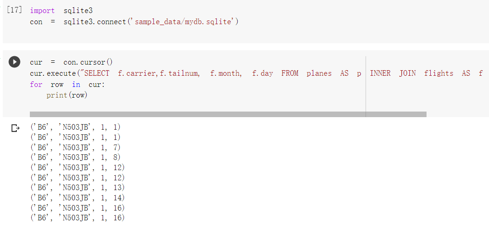

# HW2-flights

## Learning goals:

* EDA with flights dataset
* Experience with SQLite
* Simple and complex SQL queries

## Assignment

Whole code:
```
make whole code
```


## 1. Remove the outliers that we identified in class from flights.csv, and plot the joint histogram of distance vs flight using a [Seaborn joint histogram(https://seaborn.pydata.org/examples/joint_histogram.html).In one or two sentences, describe the most interesting features in the visualization.

```
make Q1
```





A joint histogram is a useful tool for visualizing the relationship between the intensities of corresponding voxels in two or more images. 
It combines the scatter plot and marginal plot. It can clearly show the density of data in different dimensions.

## 2. The scatterplot that we created in class does not clearly show a relationship between arrival delay and distance. Group the data so that your scatterplot more clearly demonstrates whether or not there's a relationship.

```
make Q2
```


Group the "dest" attribute and calculate the average arrival delay in average distance. It's can clearly demonstrate the trend of relationship between arrival delay and distance in each destination. 


## 3. The following figure is from [Chapter 13 of R for Data Science](https://r4ds.had.co.nz/relational-data.html)  by Hadley Whickam.Given that the primary key for a table in a RDBMS must be unique and that you can use multiple fields as a key, can the grayed fields in the flights table be used as a primary key for the flights table? Write a short python program that reads flights.csv to demonstrate your answer.
```
make Q3
```

Using value_counts() to count the primary keys and look for entries where the count is greater than one:


The text mentions (year, month, day, hour, flight) as possibly being a primary key for "flights" table. 
However, The code prove that (year, month, day, hour, flight,carrier) is a primary key.


## 4. Get a copy of the SQLite database in the rdata directory for the course. Write a SQL query for the database as follows:
* print the carrier, tail number, month and day for each flight
* order your query by these fields (in the order specified)
* get only those flights for which the plane is a made by "AIRBUS INDUSTRIE"
* get only the first 10 flights
```
make Q4
```



