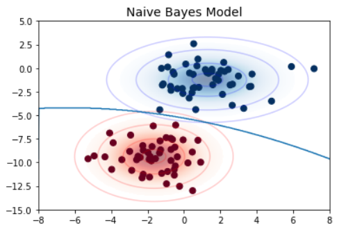
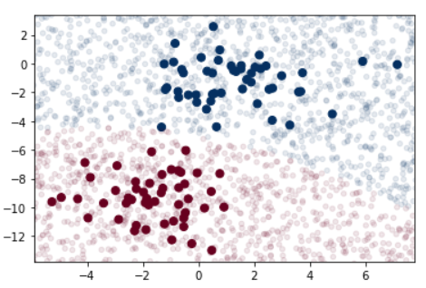
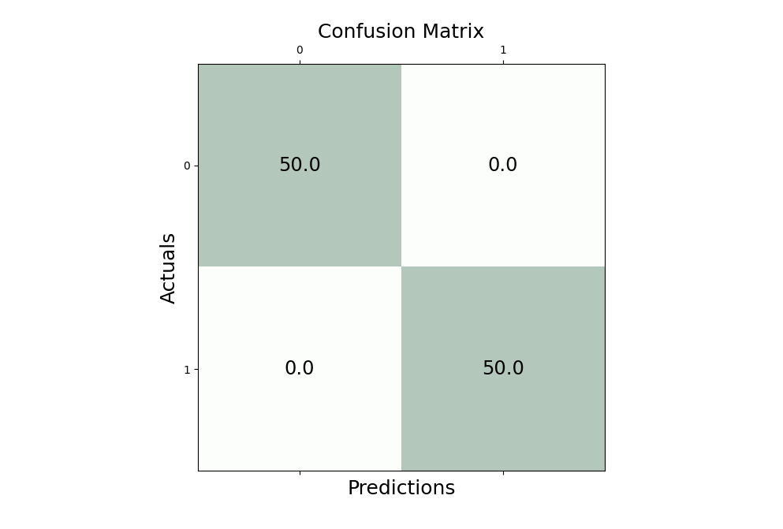
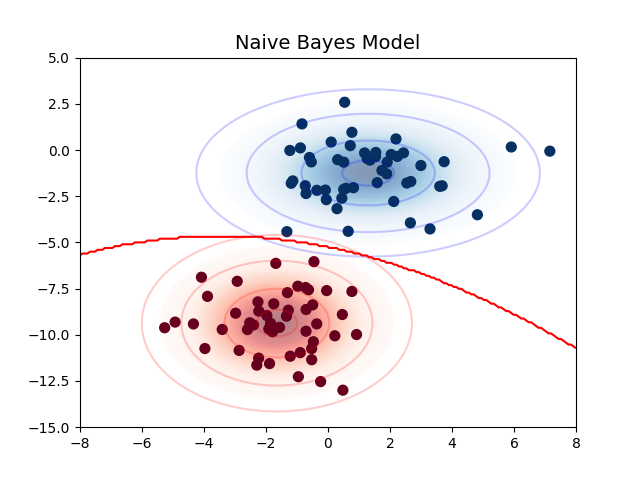
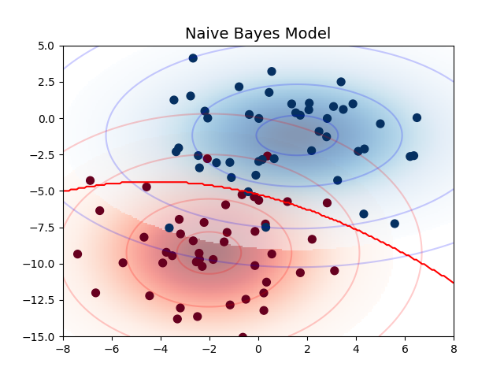
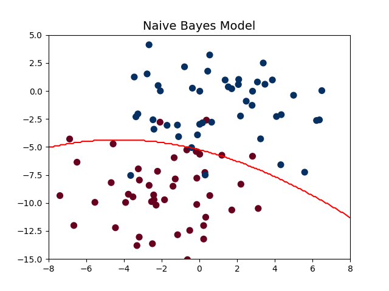

# hw3-gaussnb

## Learning goals:

* Visualize the decision boundary for Gaussian Naive Bayes in 2D
* Write a class implementing basics of the scikit-learn estimator API
* Practice with NumPy's vectorized operations

## Assignment

In [05.05-Naive-Bayes.ipynb](https://github.com/jakevdp/PythonDataScienceHandbook/blob/master/notebooks/05.05-Naive-Bayes.ipynb), Jake VanderPlas plots the distribution for 2 classes as determined by the Gaussian Naive Bayes.
The source code for the figure in [an appendix](https://github.com/jakevdp/PythonDataScienceHandbook/blob/master/notebooks/06.00-Figure-Code.ipynb) doesn't actually solve the classification problem.
Answer the questions below using only Matplotlib and NumPy.
Provide command-line instructions for reproducing your results (you can use a Makefile if you like).
Organize the code and results in different subdirectories

### Question 1

Add the decision boundary to VanderPlas's code for the figure.  You can do this with 5 lines of code or less.

```
make Q1
```



### Question 2

Write a class that implements the scikit-learn estimator API to solve the problem in question #1 using 
only `.fit()` and `.predict()` methods and attributes as needed. 
The class itself should involve less than 20 lines of code.

```
make Q2
```




### Question 3

Use the class from Question 2 to reproduce the results of Question 1. Print the confusion matrix.
Use the **same code** to create the figure and confusion matrix after doubling the standard deviation of the blob data. (You may want to use [argparse](https://docs.python.org/3/library/argparse.html))
Label the figures so it clear which is which.
Clearly identify the mistakes in the visualization.

cluster_std = 1.5 
```
make Q3a
```





cluster_std = 3.0
```
make Q3b
```




```
make Q4
```

