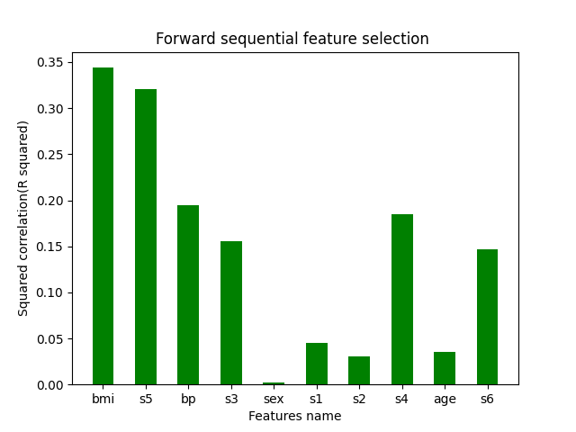

# hw4-diabetes

## Learning goals:

* Get experience with model-selection techniques (using the diabetes dataset)
* Compare feature ranking with Lasso and forward selection
* Assess dimensionality with PCR (principal component regression) and cross validation

## Assignment

Use the diabetes dataset from [sklearn.datasets.load_diabetes](https://scikit-learn.org/stable/modules/generated/sklearn.datasets.load_diabetes.html) to answer the questions below.

## Question 1

Rank the features according to their squared correlation with the target. 
Note that squared correlation is the same as R-squared for univariate regression. 
Visualize the ordered scores with a bar chart.

## Question 2

Rank the features according to the order that they're added in the [forward sequential feature selection](https://scikit-learn.org/stable/modules/generated/sklearn.feature_selection.SequentialFeatureSelector.html) algorithm. Use this ranking to reorder the bar chart in question 1.

## Question 3

Compare the bar charts in Questions 1 & 2.
Briefly discuss differences between the two charts and possible causes?
Add a figure to prove your point.

The results difference between Q1 and Q2 is mainly because that the forward sequential feature selection is equal to select top n features by choosing the subset which having the least RSS. So in this way the score in forward sequential feature selection is calculated by the whole top n features. However, Q1 method is only to calculate the squared correlation of each feature and then get a ranking base on its value.  And thus comparing with Q2, Q1 method perform worse since this method doesn't account for correlated features at all.

For example,in Q1 and Q2, the top 3 features selection ranked by both 2 methods are same:['bmi','s5', 'bp']. The 4th feature selection are different. So we test Q2 method by adding each rest feature in subset: ['bmi','s5', 'bp'] to set up a new subset ['bmi','s5', 'bp', 'rest_feature'] and then calculate the cross validation score of every new subset in order to select the best 4th feature selection.
The result are as follow:

In this bar chart, we can find that subset ['bmi','s5', 'bp', 's3'] have the highest score and the 4th feature selected is s3. So it can prove that s3 have more correlation with previous features subset. And Q1 cannot reflect the relationship between features.

## Question 4

Create a chart of the cross-validation score versis the number of components used in Principal Component Regression (PCR). Based on this chart, comment on the dimensionality of the dataset. Hint: The [CV-diabetes demo](https://scikit-learn.org/stable/auto_examples/exercises/plot_cv_diabetes.html) uses cross-validation to determine the best `alpha`. You may want to adapt parts of the code in the demo to answer Question 4.

* [PCR vs PLS](https://scikit-learn.org/stable/auto_examples/cross_decomposition/plot_pcr_vs_pls.html)
* The first cell below is adapted from 
* The second cell below is adapted from the [CV-diabetes demo](https://scikit-learn.org/stable/auto_examples/exercises/plot_cv_diabetes.html)

Based on the cross validation scrore, the best number of principal component is 7 

## Question 5

The [lasso lars demo](https://scikit-learn.org/stable/auto_examples/linear_model/plot_lasso_lars.html) computes and plots the coefficients with lasso. Add a legend to the plot so that you can relate colors to feature names. Briefly compare the lasso ordering to your answers above.

* [lasso lars demo](https://scikit-learn.org/stable/auto_examples/linear_model/plot_lasso_lars.html)
* [sklearn.linear_model.lars_path](https://scikit-learn.org/stable/modules/generated/sklearn.linear_model.lars_path.html) -- returns lasso coefficients along the lars path
  * return value includes "active"
  * "active" is a list of indices at the end of the path
* [sklearn.linear_model.lasso_path](https://scikit-learn.org/stable/modules/generated/sklearn.linear_model.lasso_path.html) -- returns lasso coefficients along path of coordinate descent

lasso order: ['bmi', 's5', 'bp', 'sex', 's6', 's1', 's4', 's2', 'age', 's3'].

squared correlation order: ['bmi', 's5', 'bp', 's4', 's3', 's6', 's1', 'age', 's2', 'sex'].

forword sequential feature selection order : ['bmi', 's5', 'bp', 's3', 'sex', 's1', 's2', 's4', 'age', 's6'].
